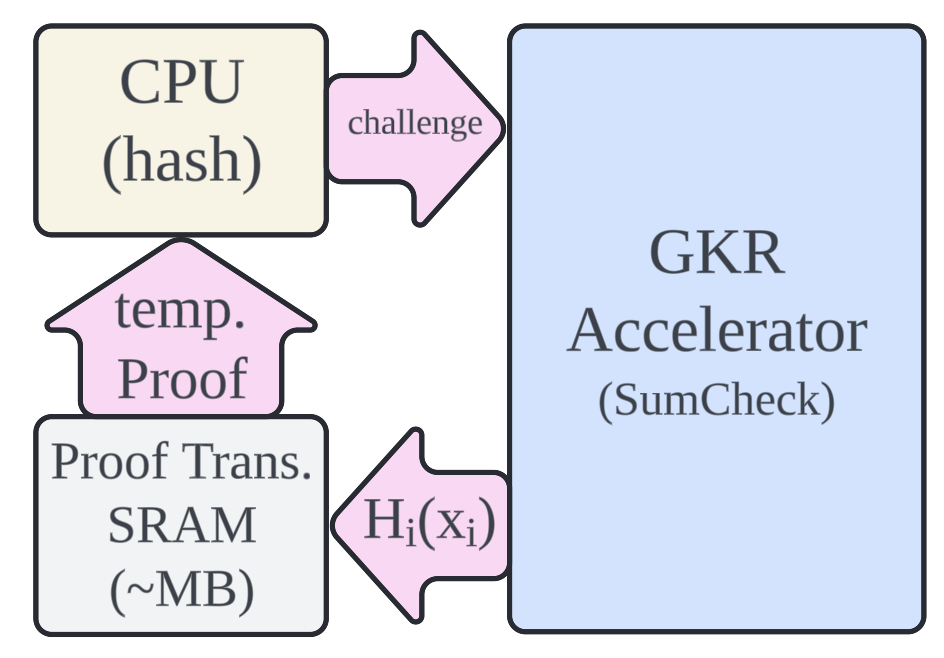

# Accelerating Zero-Knowledge Proof Systems with Specialized Hardware: The Role of FPGA and ASIC in Enhancing Goldreich-Krawczyk-Rackoff (GKR) Protocols

## Introduction

In the evolving landscape of cryptographic protocols, zero-knowledge proof (ZKP) systems stand out due to their ability to verify the correctness of information without revealing the information itself. A particular type of ZKP, the Goldreich-Krawczyk-Rackoff (GKR) protocol, has shown promising applications in privacy-preserving computations and secure multi-party computations. However, as the complexity and scale of these applications grow, so does the demand for more efficient computation methods. This is where specialized hardware like Field Programmable Gate Arrays (FPGA) and Application-Specific Integrated Circuits (ASIC) come into play.

## The Need for Speed in ZKP

ZKPs are computationally intensive and require significant resources to execute, especially in scenarios involving complex data sets and high-frequency verification demands. The GKR protocol, while efficient in theoretical terms, can benefit greatly from hardware acceleration to meet practical performance requirements.

## FPGA and ASIC: Catalysts for Enhanced GKR Performance

FPGAs and ASICs provide customizable, high-performance computing solutions that can be specifically tailored to enhance the GKR protocol. Here’s how these technologies can make a difference:

1. **Customization for Optimization**: FPGAs allow for the programming of hardware to execute specific tasks such as the polynomial evaluations and interactive proofs required in GKR. ASICs take this a step further by offering optimized, fixed-functionality chips designed for executing GKR operations at even higher speeds and lower power consumption.

2. **Parallel Processing Capabilities**: Both FPGA and ASIC technologies excel in handling parallel processes. This is crucial for scaling ZKP computations, enabling simultaneous processing of multiple proof validations or generation tasks, significantly cutting down the overall computation time.

3. **Energy Efficiency**: With the increasing emphasis on sustainable computing, the energy efficiency of FPGAs and ASICs is a significant advantage. These technologies consume less power compared to general-purpose processors, especially when tuned for specific tasks like those involved in GKR.

## Limitation? Accelerate GKR in Linear Time

The problem of original Sum-check protocol used in [Tha'13] leads to $O(2^{2\cdot log(n)}) = O(n^2)$ time complexity, which is not applicable for hardware implementation. A notable advancement in the optimization of GKR protocols comes from exploiting the inherent sparsity found in arbitrary circuits. According to research presented in the [XZZ'19], by strategically analyzing and utilizing the sparse characteristics of circuits, it is possible to significantly enhance the efficiency of GKR computations. This approach focuses an technique that break Sum-check computation (consists of multiple round of Multi-linear Extension, MLE evaluation) into two phases, which leads to construct two small bookkeeping tables in $O(n)$ time. As a result, the original $O(n^2)$ problem breaks into two $O(n)$ problems, making hardware specialization practical.

The key to this method lies in a careful construction of bookkeeping table before each Sum-check phase by exploiting the sparsity between each neighboring layers throughout GKR protocol. By employing linear-time algorithms that adapt to the sparsity levels of the circuits, the prover phase of the GKR can be optimized. This results in a more streamlined process that not only speeds up the computation but also minimizes the resources required for generating and verifying proofs.

This technique is particularly effective for large-scale applications where the arbitrary circuit complexity can otherwise lead to bottlenecks. By harnessing the sparsity, systems can achieve linear scalability in terms of both time and space, making it feasible to implement more complex and secure zero-knowledge proofs in practical, real-world systems.

### Example Hardware Architecture and Upper-bound study

Due to the nature of spatial locality of GKR protocol, an example hardware solution can be like below. 

 

GKR Accelerator contains a flatten circuit structure with two small physical SRAMs, as the physical storage of two bookkeeping tables. The neighboring two GKR layers can be streamed into GKR accelerator. For each round of Sum-check protocol, GKR accelerator requests one random challenge via hard-wired logics (or just tiny CPU) from *Proof Transcript SRAM* and proceed to next round.

We can do a simple calculation to study the upper bound on an example arbitrary circuit with 100 layers, 1024 gates per layer. Assuming the MLE of each round Sum-check are completely flattened and unlimited fast, the bottleneck becomes the number of time that GKR accelerator request for random oracle from Proof transcript SRAM. The number of random oracle request time is:

$$
100\ layers \times (2 \times log_{2}(1024) + 2) = 2,200\ challenges
$$

However, this approach is not practical because obviously the bottleneck will become the original hardware implementation for a non-linear Sum-check protocol, where $log_21024 + log_21024 = 20$ variables' multi-linear extension (MLE) to be evaluated, leading to a $2^{20}$ rows bookkeeping table at the first round of Sum-check. However, this problem can be solved by applying the technique from [XZZ'19] where the problem of $O(n^2)$ is broken into two $O(n)$ problems and each problem can be solved by sacrificing a bookkeeping table with $O(n)$ size, leading hardware specialization to be practical.

## Conclusion

The intersection of cryptographic protocols like GKR with advanced hardware technologies such as FPGA and ASIC represents a pivotal development in the field of data security. By harnessing the power of specialized hardware, the implementation of zero-knowledge proofs can be made more efficient, paving the way for broader adoption and more robust applications in the digital world.

[Tha13](https://eprint.iacr.org/2013/351.pdf): Justin Thaler. Time-optimal interactive proofs for circuit evaluation. In Proceedings of the
International Cryptology Conference (CRYPTO), 2013.

[XZZ'19](https://eprint.iacr.org/2019/317.pdf): Xie, T., Zhang, J., Zhang, Y., Papamanthou, C., & Song, D. (2019). Libra: Succinct zero-knowledge proofs with optimal prover computation. In Advances in Cryptology–CRYPTO 2019: 39th Annual International Cryptology Conference, Santa Barbara, CA, USA, August 18–22, 2019, Proceedings, Part III 39 (pp. 733-764). Springer International Publishing.
