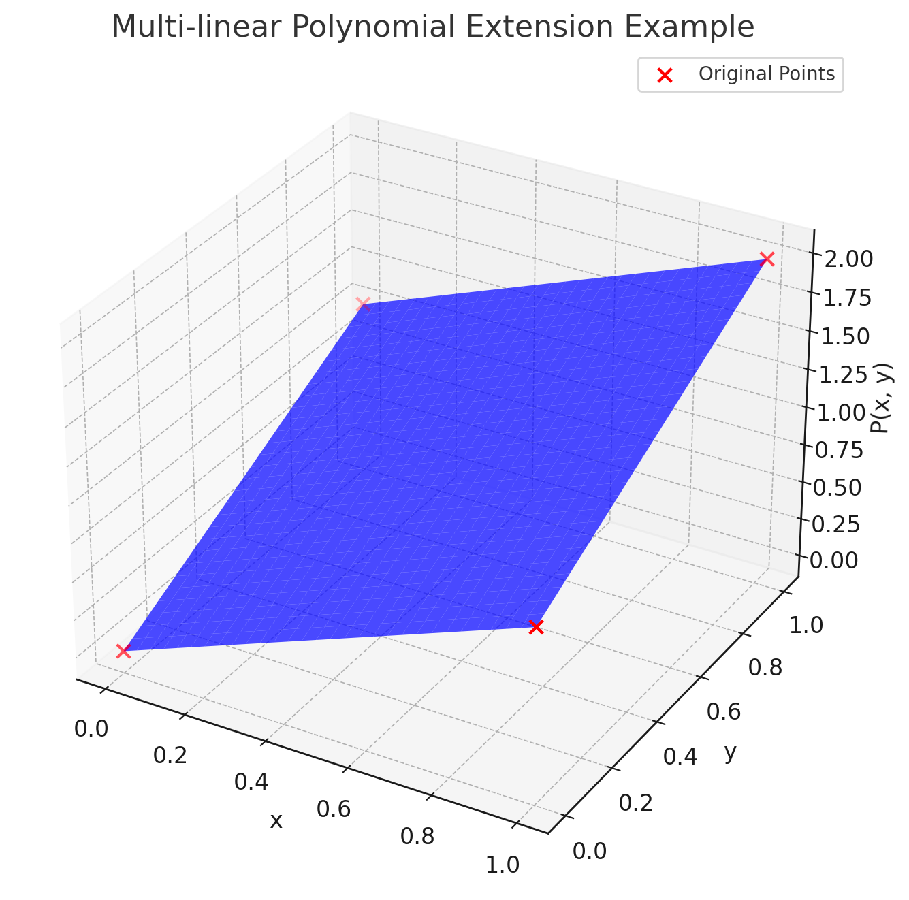

# Multi-linear extension
## Introduction
In the evolving cryptography landscape, zero-knowledge proofs stand out as a cornerstone for privacy-preserving protocols. A zero-knowledge proof allows one party, the prover, to convince another party, the verifier, of the truth of a statement without revealing any information beyond the validity of the statement itself. This blog post explores the concept of multi-linear extensions, a sophisticated mathematical tool that enhances the capabilities of zero-knowledge proofs, making them more efficient and versatile.

## Understanding Multi-linear Extensions
Multi-linear extensions represent an advanced algebraic technique used to extend a polynomial defined on a discrete set of points to a continuous domain. Essentially, given a function that is defined over a finite field or a set of discrete points, a multi-linear extension allows for the construction of a new polynomial in multiple variables that agrees with the original function on the given points but is also capable of being evaluated at any point within a continuous space.

This extension is achieved by interpolating the original function to find a polynomial that matches the function's values on the specified points. The beauty of multi-linear extensions lies in their ability to preserve the structure and relationships of the original function while extending its applicability to a broader domain. This property is particularly useful in cryptographic applications, where functions defined on discrete sets need to be manipulated and evaluated in more flexible ways.

## Example
Consider a binary function defined on a discrete set of points in a 2-dimensional space. Our objective is to extend this function to a continuous domain while preserving its linearity with respect to each variable. This is where multi-linear polynomials come into play, serving as an ideal mechanism for achieving such an extension.

Let's define a binary function $f: \{0, 1\}^2 \rightarrow \mathbb{R}$ with values at the vertices of a unit square as follows:

- $f(0, 0) = 0$
- $f(1, 0) = 1$
- $f(0, 1) = 1$
- $f(1, 1) = 2$

Our goal is to find a multi-linear polynomial $P(x, y)$ that matches these values at the given points and can be evaluated on any real-valued inputs $(x, y)$ within the square.

A multi-linear polynomial that fits these points can be formulated as follows since we are dealing with a function that linearly increases based on the input values:

$$P(x, y) = ax+by+cxy+d$$

Given the specified values of $f$, we can determine $a, b, c$ and $d$. However, since we already know $f$ is defined on a binary space and we wish to extend it multi-linearly, we can calculate the coefficients based on the function's behavior at the vertices:

- To satisfy $f(0, 0) = 0$, we have no constant term, so $d=0$.
- To satisfy $f(1, 0) = 1$ and $f(0, 1) = 1$, we see that each input contributes linearly, so $a = 1$ and $b = 1$.
- To satisfy $f(1, 1) = 2$, which is the sum of the individual contributions without any additional interaction term, we set $c = 0$.

Thus, the multi-linear polynomial that correctly represents this function is:

$$P(x, y) = x + y$$

Let's visualize this multi-linear polynomial $P(x, y) = x + y$ along with the original discrete points to demonstrate how it extends the function to a continuous domain.

The figure visualizes the multi-linear polynomial $P(x, y)=x+y$ and its application as an extension from the discrete points to a continuous domain. The original discrete points are highlighted in red, showing their positions in the 2-dimensional binary space and their corresponding function values. The blue surface represents the continuous extension provided by the multi-linear polynomial across the unit square, illustrating how the function linearly interpolates values based on $x$ and $y$ inputs. This example showcases the principle of multi-linear extension, allowing the original binary function to be evaluated over a continuous range while preserving its linear behavior across dimensions. 

## Application in Zero-Knowledge Proofs
The utilization of multi-linear extensions in zero-knowledge proofs is a game-changer. By enabling the compact representation and efficient evaluation of polynomials, multi-linear extensions facilitate the construction of more sophisticated and scalable zero-knowledge proof systems. These systems can securely verify complex statements and computations without revealing any underlying data or compromising privacy.

One of the key benefits of using multi-linear extensions in zero-knowledge proofs is the reduction in the computational complexity and communication overhead associated with the proof process. This efficiency gain is crucial for applications that require the verification of complex statements, such as those encountered in blockchain technologies, secure multiparty computation, and privacy-preserving data sharing.

For instance, consider the scenario where we have two distinct functions, $F(x, y)$ and $G(x, y)$, and our objective is to validate that their evaluations at the points $(0, 0), (1, 0), (0, 1)$ and $(1, 1)$ are equivalent. The straightforward, or naive, method would necessitate the verifier to individually examine the outcomes of both functions at each of these four coordinates, which could be computationally intensive in more complex scenarios. 

To streamline this process, the prover can initially derive the multi-linear extensions of these functions, denoted as $PF(x, y)$ and $PG(x, y)$ respectively. These extensions effectively interpolate the functions over a continuous domain, thus facilitating a more efficient verification process. Instead of comparing the functions' values at discrete points, the verifier can now simply assess whether $PF(x, y)$ and $PG(x, y)$ are congruent over the entire domain.

To enhance the efficiency and effectiveness of this verification process further, we can leverage the Schwartz-Zippel lemma, as discussed in our previous exposition (refer to Blog 1). This lemma provides a probabilistic method for determining polynomial equality by evaluating polynomials at a randomly selected point. Consequently, instead of exhaustively checking the evaluations of $PF(x, y)$ and $PG(x, y)$ at the four distinct points $(0, 0), (1, 0), (0, 1)$ and $(1, 1)$, the verifier can opt for a more streamlined approach. By selecting a random point $(rx, ry)$ within the relevant domain, the verifier can simply assess the equality $PF(rx, ry) = PG(rx, ry)$. This method significantly reduces the computational overhead from evaluating both functions at four points to just comparing their values at a single, randomly chosen point. The probabilistic nature of the Schwartz-Zippel lemma ensures that if $PF(x, y)$ and $PG(x, y)$ are indeed identical over the entire domain, the likelihood of them having the same value at $(rx, ry)$ is high. Conversely, if the polynomials are not identical, the probability that they coincide at this randomly chosen point is correspondingly low. This strategic application of the Schwartz-Zippel lemma thereby streamlines the verification process, making it both efficient and robust, particularly suitable for scenarios where computational resources are at a premium or when dealing with complex polynomial functions in cryptographic protocols. 

When extending the application of multilinear extensions and the Schwartz-Zippel lemma to polynomials with $n$ variables, the potential for efficiency gains becomes even more significant. That said, a single evaluation point check suffices for checking the equivalence of two distinct functions with $2^n$ values, which could uniquely decide a multi-linear extension.

This approach not only reduces the computational burden but also enhances the verification's robustness, as it implicitly confirms the functions' equivalence over an infinite set of points within the defined domain, rather than at just a handful of discrete locations. This methodology exemplifies the power and utility of multi-linear extensions in cryptographic proofs, particularly in the context of zero-knowledge proofs where verifying the equivalence of complex computations efficiently and securely is paramount.

## Conclusion
Multi-linear extensions play a pivotal role in the advancement of zero-knowledge proofs, offering a powerful tool for enhancing both the efficiency and security of cryptographic protocols. As we continue to explore and develop these technologies, the potential for creating more robust and privacy-preserving systems becomes increasingly apparent. The application of multi-linear extensions in zero-knowledge proofs represents a significant step forward in our quest to secure digital communication and computation in an increasingly interconnected world.